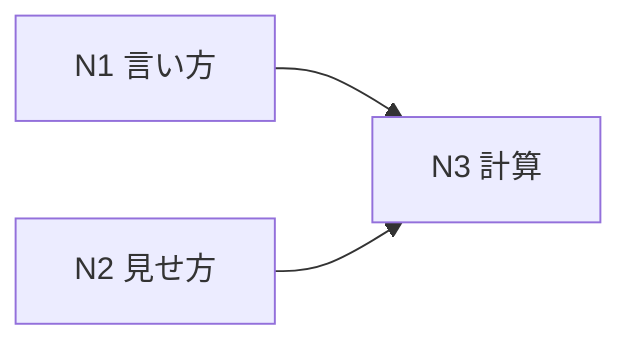

# UoDia 実装計画書 v1.1

| 項目 | 内容 |
| --- | --- |
| ドキュメント版数 | 1.4 |
| 作成日 | 2026-08-04 |
| 対象 | UoDia v1.1 |
| 前提仕様書 | [specification-v1.1.md](specification-v1.1.md) v1.6 |
| 前提 | [implementation-plan.md](implementation-plan.md)（v1.0、T-01〜T-55） |

### 改訂履歴

| 版 | 日付 | 内容 |
| --- | --- | --- |
| 1.0 | 2026-08-04 | 初版。issue #158〜#168 に対する T-56〜T-65 を起こす。 |
| 1.4 | 2026-08-06 | **v1.1.0 とした。** T-66（LICENSE）は Q-16 が解けておらず、本書の始めから「解けるまで着手しない」としてある。**残すものを残したまま版数を上げる**——T-66 は配布物の中身を変えず、待っても v1.1 の他の 11 件が利用者へ届く時期が遅れるだけである。 |
| 1.3 | 2026-08-05 | 運用一覧の距離の見せ方（#185）を T-69 として起こした。 |
| 1.2 | 2026-08-05 | **T-64（輸送能力）と T-65（フォーカス範囲）を見送った。** 機能として不要になったため実装を取り消した。**N3 に残るのは T-63（区間距離）だけ**である。 |
| 1.1 | 2026-08-05 | 実装中に判明した分を追加。**#167 は 2 件が混ざっていた**ため #171 を切り出し、T-67 とした。実機で見ての訂正から #179 が起き、T-68 とした。 |

---

## 1. 本書の位置づけ

**v1.0 の実装計画書を置き換えない。** タスク番号は T-55 の続き（**T-56〜T-69**。うち T-64・T-65 は見送り）とする。方針（[§2 開発方針](implementation-plan.md)）・技術的な設計判断（§3）・issue 化の方針（§7）は v1.0 の本書をそのまま引く。

**1 タスク = 1 issue** の対応も引き継ぐが、v1.1 は**先に issue があり、後からタスクを起こした**点が v1.0 と逆である。したがって issue タイトルは `[T-xx]` に付け替えず、**既存の issue 番号（#158〜#168）をそのまま使う。**

| | v1.0 | v1.1 |
| --- | --- | --- |
| 起点 | 仕様書 → タスク → issue | **issue → 仕様書 → タスク** |
| issue タイトル | `[T-xx] タスク名` | **元のまま**。本文に T 番号を書く |

**#163（GTFS 書き出し）にタスクを起こさない。** 要件が未定であり、v1.1 に含めないと決めた（仕様書 v1.1 §7.4）。

---

## 2. マイルストーン

v1.0 の M0〜M6 とは別に、**v1.1 は 3 つの束**で進む（仕様書 v1.1 §1.1）。



| # | 束 | 内容 | 特徴 |
| --- | --- | --- | --- |
| **N1** | 言い方 | #158・#159・#168 | 文字列だけ。データも画面構造も変わらない |
| **N2** | 見せ方 | #160・#164・#165・#167 | 既にある情報を出し直す。データは増えない |
| **N3** | 計算 | #161・#162・#166 | **データモデルが増える。** 互いに依存する |

**N1 と N2 は互いに独立であり、どのタスクからでも入れる。** N3 だけが順序を持つ。

---

## 3. タスク一覧

| # | タスク | issue | 束 | 優先度 | 規模 | 依存 |
| --- | --- | --- | --- | --- | --- | --- |
| T-56 | コピーライトの表記と「UoDia について」への著作権表示 | #158 | N1 | v1 | S | — |
| T-57 | 「後運用」を「次運用」に改める | #159 | N1 | v1 | S | — |
| T-58 | 未保存の問いの文言と本文 | #168 | N1 | v1 | S | — |
| T-59 | ダイヤ削除の確認 | #160 | N2 | v1 | S | — |
| T-60 | アンカーの色付けの廃止 | #164 | N2 | v1 | S | — |
| T-61 | 検証の 2 件出しと時刻表のエラー表示 | #165 | N2 | v1 | M | — |
| T-62 | 折返しの接続線 | #167 | N2 | v1 | M | — |
| T-67 | ダイヤグラムの端で停車点の円が欠ける | #171 | N2 | v1 | S | — |
| T-68 | 回送スジの色・線種の上書きとヒゲの長さ | #179 | N2 | v1 | S | T-62 |
| T-63 | 区間距離（`route.json` 版数 2） | #161 | N3 | v1 | M | — |
| T-69 | 運用一覧の距離の見せ方 | #185 | N3 | v1 | S | T-63 |
| ~~T-64~~ | ~~輸送能力（系統ごとの定員）~~ | #162 | N3 | — | — | **見送り（2026-08-05）** |
| ~~T-65~~ | ~~フォーカス範囲と計算パネル~~ | #166 | N3 | — | — | **見送り（2026-08-05）** |

**規模の目安**（v1.0 と同じ）: S ≈ 0.5 人日 / M ≈ 1.5 人日 / L ≈ 4 人日

| 束 | 件数 | 内訳 | 概算 |
| --- | --- | --- | --- |
| N1 | 3 件 | S 3 | 1.5 人日 |
| N2 | 6 件 | S 4 / M 2 | 5.0 人日 |
| N3 | 2 件 | S 1 / M 1 | 2.0 人日 |
| **合計** | **11 件** | **S 8 / M 3** | **約 8.5 人日** |

**N1 の 3 件は 1 日で入る。** 先に入れて、v1.1 のリリースの形を早く確かめる。

---

## 4. 技術的な設計判断

v1.0 の §3 に足すもの。

### 4.1 v1.1 で変える型は無い

**3 つの当初案がいずれも取り下がった**（仕様書 v1.1 §8.4）。

| 型 | 当初の案 | 決着 |
| --- | --- | --- |
| `ValidationTarget` | `tripIds: readonly string[]` へ一本化 | **変えない。** 両側から 2 件出す |
| `FileDialogs.confirmDiscard` | `DiscardIntent` を足す | **変えない。** 本文の文字列を引数で渡す |
| `PlatformAdapter` | `storeNetworkDef` ほか | **足さない。** `route.json` の差し替えを見送る |

**足すのは値だけである** — `route.json` に 1 項目、プロジェクトに 3 項目。

### 4.2 検証の 2 件出し（T-61）

**2 便が絡む項目は、前から見た指摘と後ろから見た指摘の 2 件を出す。** 実装上の要点は 3 つ。

| 要点 | 内容 |
| --- | --- |
| **文面は視点ごとに書く** | 「次の便が…」と「前の便が…」を別の文字列として持つ。同じ文を使い回すと、片方の列で意味が通らない |
| **重複を作らない** | 運用内の隣接ペアを 1 回走査し、その場で 2 件を積む。前向き・後ろ向きに 2 回走査すると、条件式を 2 か所に持つことになる |
| **並び順は今までどおり** | 重い順・項目番号順（仕様書 §6.6.1）。**同じ事象の 2 件が隣り合うことは保証しない**——保証しようとすると、並べ替えの規則が「同じ事象か」を知る必要が出る |

### 4.3 接続線の段（T-62）

**重なりの解消は描画の直前ではなく、場面（`DiagramScene`）を組む段階で行う。**

理由は v1.0 §3.5（描画関数の引数化）と同じである。**描画関数は渡された座標を引くだけにする。** 段の割り当ては純関数として切り出し、テストで固定する。

```
assignDwellLevels(dwells) → 各接続線の段（0, 1, 2…）
```

- 入力は「停留所・開始時刻・終了時刻・運用番号」の並び
- **停留所ごとに区切り、開始時刻の昇順に、時間帯が交わらない最小の段へ入れる**
- 段は px でしか使わないため、この関数は拡大率も画面の大きさも知らない

### 4.4 距離の導出（T-63）

**`domain/` に置く純関数とする。** 便・運用・区間表を受け取り、数を返す。ストアも画面も知らない。

| 関数 | 置き場所 |
| --- | --- |
| 便の距離 | `domain/trip/distance.ts` |
| 走行距離・営業距離 | `domain/block/distance.ts` |

> 輸送力と断面の導出もここに書いていたが、T-64・T-65 の見送りに伴って落とした。

---

## 5. タスク詳細

### N1: 言い方

---

#### T-56 コピーライトの表記と「UoDia について」への著作権表示

**目的**: 仕様書 v1.1 §3.1 を実装する（#158）。

**背景**: 団体名は「再履バス同好会」であり、「再履同好会」は誤り。あわせて、**著作権表示が画面のどこにも出ていない**——`publisher` と `copyright` はインストーラと実行ファイルのプロパティにしか無く、Web 版には bundle 設定そのものが無い。

**作業内容**

- [ ] `src-tauri/tauri.conf.json` の `bundle.publisher` / `bundle.copyright` を「再履バス同好会」に直す
- [ ] 著作権表示の文字列を 1 か所に定義する（`features/shell/version.ts` に隣接させる）
- [ ] `HelpDialog` の「UoDia について」に `© 2026 再履バス同好会` を出す
- [ ] `DocumentDialog.test.tsx` が打ち込む値も直す（テストの入力値であり必須ではない）

**受入条件**

- [x] リポジトリ全体を「再履同好会」で検索して 0 件（`docs/` の参考資料リンクを除く）
- [x] 「UoDia について」に著作権表示が出る
- [x] 年を書き換える運用を作っていない（`© 2026` 固定）
- [x] **`publisher` を変えたときの上書き挙動を決めた記録が残っている**（仕様書 v1.1 §3.1.1、README の「配布物」）
- [x] **`.deb` の `Maintainer` を実物で確かめた** → `sairidoukoukai` と出ており**未達だった**。`Cargo.toml` の `authors` を直した（仕様書 v1.1 §3.1.2）
- [ ] **次のビルドで `.deb` の `Maintainer` が `再履バス同好会` になっている**
- [ ] **`.exe` / `.msi` のプロパティに「再履バス同好会」と出る**
- [ ] **`.app` の `NSHumanReadableCopyright` が同じ表記になっている**

**確かめ方**

CI は 3 OS 分を artifact に残している（README の「タグを打たずに配布物を取る」）。

```bash
gh run download -n uodia-Linux -D <保存先>
dpkg-deb -f <保存先>/deb/*.deb Maintainer      # → 再履バス同好会
```

macOS は `.app/Contents/Info.plist` の `NSHumanReadableCopyright`、Windows は `.exe` のプロパティ（詳細タブ）で見る。

> **設定を読むだけでは分からなかった。** `.deb` の `Maintainer` は `bundle.publisher` ではなく `Cargo.toml` の `authors` から作られ、**authors のほうが優先される。** 実物を開くまで気づけなかった。**配布物にしか現れない値は、配布物を見て確かめる。**

**やらないこと**: LICENSE ファイルの追加（T-66 として別に起こす。仕様書 v1.1 §12）

**規模**: S ／ **優先度**: v1 ／ **依存**: —

---

#### T-57 「後運用」を「次運用」に改める

**目的**: 仕様書 v1.1 §3.2 を実装する（#159）。

**背景**: 「後」は時間的な後とも順序上の後ろとも読める。運用の話をしているときに「後」と書くと、**「あとで走る便」なのか「この便の後ろに繋がっている便」なのか**が字面から決まらない。「次」は順序の話しかしていない。

**作業内容**

- [ ] `TimetableGrid.tsx` の見出しの文字（`title="後運用"`）を「次運用」に直す
- [ ] `aria-label`（`〜の後運用`）も直す
- [ ] `features/timetable/model.ts` ほかのコメントを直す
- [ ] `TimetableGrid.test.tsx` / `Timetable.test.tsx` の期待値を直す

**受入条件**

- [ ] 画面と読み上げの両方で「次運用」になる
- [ ] **「前運用」は変えていない**
- [ ] コード上の識別子（`before` / `after` 等）は改名していない

**規模**: S ／ **優先度**: v1 ／ **依存**: —

---

#### T-58 未保存の問いの文言と本文

**目的**: 仕様書 v1.1 §3.3 を実装する（#168）。

**背景**: `ensureSaved()` を呼ぶのは 4 か所（新規作成・開く・最近使ったファイル・終了）であり、**「保存して終了」にすると 3 か所で嘘になる。** 選択肢からこのあと起きることを落とすと、4 か所すべてで正しくなる。

**作業内容**

- [ ] 選択肢を「**保存する**」「**保存しない**」「**キャンセル**」に改める（`FileDialogHost.tsx`）
- [ ] `confirmDiscard` に本文の文字列を渡せるようにする（`prompts.ts`。**型の形は変えない**）
- [ ] 呼び出し元 4 か所が本文を渡す（`fileService.ts`）
  - 終了: `…保存せずに終了しますか。`
  - 開く / 最近使ったファイル: `…保存せずに別のファイルを開きますか。`
  - 新規作成: `…保存せずに新規作成しますか。`
- [ ] `prompts.ts` のコメント（「保存して続ける」等）を直す

**受入条件**

- [ ] 4 つの入口それぞれで、本文がこのあと起きることと一致する
- [ ] `DialogAnswer` は `save` / `discard` / `cancel` のまま
- [ ] **`DiscardIntent` のような型を導入していない**
- [ ] 想定外の答えを「キャンセル」として扱う既存の振る舞いが残っている

**規模**: S ／ **優先度**: v1 ／ **依存**: —

---

### N2: 見せ方

---

#### T-59 ダイヤ削除の確認

**目的**: 仕様書 v1.1 §4 を実装する（#160）。

**背景**: 削除は履歴に載っており <kbd>Ctrl</kbd>+<kbd>Z</kbd> で戻る。**それでも確認を挟むのは、戻せることが画面から読めない**ためである。`✕` は名前の欄のすぐ隣にある。

**作業内容**

- [ ] 便が 1 つ以上あるダイヤの削除に確認を挟む（`ServiceList.tsx`）
- [ ] 問いに便数を出す（`授業期間平日ダイヤ（120 便）を削除します。`）
- [ ] 既定の焦点を**キャンセル**に置く
- [ ] 既存の問いの仕掛け（`FileDialogHost` の `<dialog>`）に載せる

**受入条件**

- [ ] **便が 0 のダイヤは確認なしで消える**
- [ ] <kbd>Enter</kbd> を続けて押しても消えない
- [ ] 最後の 1 つが `disabled` である振る舞いは変わっていない
- [ ] 削除は今までどおり履歴に載る
- [ ] **便の削除（<kbd>Delete</kbd>）には確認が出ない**

**規模**: S ／ **優先度**: v1 ／ **依存**: —

---

#### T-60 アンカーの色付けの廃止

**目的**: 仕様書 v1.1 §5.1 を実装する（#164）。

**背景**: **どの升目に打っても同じように打てる**（打った升目がアンカーになる）。利用者から見て振る舞いが同じものを色で分けている。凡例も無く、色の理由は最後まで分からない。T-61 でエラーの色が加わると重なる。

**作業内容**

- [ ] `.timetable__cell--anchor` と `.timetable__cell--selected.timetable__cell--anchor` を消す（`app/styles.css`）
- [ ] `--color-anchor` を消す（ライト・ダークの両方）
- [ ] `TimetableGrid.tsx` の分岐（`cell.isAnchor` でクラスを足す箇所）を消す
- [ ] 関係するテストを落とす

**受入条件**

- [ ] 時刻表にアンカー由来の地色が出ない
- [ ] `Trip.anchor` はデータとして残っている（何も変わっていない）
- [ ] **戻すための設定を足していない**
- [ ] `--color-anchor` がどこからも参照されていない

**規模**: S ／ **優先度**: v1 ／ **依存**: —

---

#### T-61 検証の 2 件出しと時刻表のエラー表示

**目的**: 仕様書 v1.1 §5.2・§9.3 を実装する（#165）。

**背景**: 検証の指摘は検証パネルにしか出ていない。時刻表を見ているあいだ、どの列に問題があるのか分からない。**2 便が絡むエラーは、片方だけ塗ると「どちらが悪いのか」を探すことになる。**

**作業内容**

- [ ] V-01・V-02・V-03・V-06 を**両側から出す**（`domain/validation/validate.ts`）
  - [ ] 文面を視点ごとに書き分ける（「次の便が…」／「前の便が…」）
  - [ ] 隣接ペアの走査は 1 回のままとし、その場で 2 件を積む（[§4.2](#42-検証の-2-件出しt-61)）
- [ ] 時刻表の列見出しに印を出す（`features/timetable`）
  - [ ] 重大度を**記号・言葉・色の 3 つ**で示す（仕様書 §9.4）
  - [ ] **地色を変えるのはエラーだけ。** 警告・情報は記号のみ
  - [ ] 2 件以上付く便は**最も重い 1 つ**で示す
  - [ ] 印に `title` を付け、指摘の文言をそのまま出す
- [ ] `ValidationTarget` は**変えない**

**受入条件**

- [ ] 折返し時分が負のとき、**前の便と次の便の両方**の列に印が付く
- [ ] それぞれの列の `title` が、その便の視点で書かれている
- [ ] 検証パネルの件数が 2 件になる（**1 件にまとめない**）
- [ ] 情報（V-07・V-08）で地色が変わらない
- [ ] `ValidationTarget` の型が変わっていない
- [ ] ドメイン層のカバレッジ 100% を保つ

**やらないこと**: ダイヤグラムのスジの色を変えること（着色モードと二重になる）

**規模**: M ／ **優先度**: v1 ／ **依存**: —

---

#### T-62 折返しの接続線

**目的**: 仕様書 v1.1 §5.3 を実装する（#167）。

**背景**: 運用で着色しても、どの便がどの便に繋がるかは読めない。**留まっているあいだを正直に描くと台形になる**——台形を描く仕掛けを別に持つのではない。

**作業内容**

- [ ] 段の割り当てを純関数として切り出す（[§4.3](#43-接続線の段t-62)）
- [ ] `DiagramScene` に接続線を積む（`features/diagram/scene.ts`）
  - [ ] 条件: 同一運用の連続する 2 便・終着と始発の停留所が一致・折返し時分が正
  - [ ] 色は**運用の色**（着色モードによらず）。運用番号が空欄なら引かない
  - [ ] 営業スジより細い**破線**
  - [ ] 段は 4px 固定。向きは軸の外側（中点 20 より小さければ上、以上なら下）
  - [ ] 上下に 20px の余白。入りきらない分は最後の段に重ねる
- [ ] 描画する（`features/diagram/drawTrips.ts`）
- [ ] 表示の切替をサイドパネルに置く（`view.showBlockLinks`、既定 `true`）

**受入条件**

- [ ] 折返し時分が 0 分のとき線を引かない
- [ ] V-01 / V-02 に当たる 2 便を繋がない
- [ ] **豊中学舎で 3 台が同時に留まると、3 本が 4px ずつ上へ積まれる**
- [ ] 1 台だけのときは停留所の線の上に載る（段 0 はずらさない）
- [ ] 接続線を掴んでも何も選ばれない
- [ ] 入区して出区するあいだには引かれない
- [ ] 段の割り当て関数が拡大率にも画面の大きさにも依存しない

**規模**: M ／ **優先度**: v1 ／ **依存**: —

---

### N3: 計算

---

#### T-67 ダイヤグラムの端で停車点の円が欠ける

**目的**: #171 を直す。#167 に入っていた 2 件目を切り出したもの。

**背景**: 豊中学舎は `axisPosition: 0`（軸の先頭）であり、一番上まで送ると停留所線がちょうど `originY` に来る。`drawTrips` はクリップ矩形の上端を `originY` に取っているため、**停車点の丸（半径 3.5px）の上半分が切れる。** 一番下の停留所でも同じことが起きる。

**作業内容**

- [x] `AXIS_EDGE_MARGIN`（8px）を `viewport.ts` に置く
- [x] `axisToY` / `yToAxis` に余白を挟む
- [x] `scrollRanges` の `visibleAxis` から上下 2 つぶんを引く
- [x] 拡大の中心合わせ（`viewAfterWheel`）も同じ分だけ引く

**受入条件**

- [x] 縦スクロールを上限まで動かしても、豊中学舎の停車点の円が欠けない
- [x] 下限でも、一番下の停留所の円が欠けない
- [x] 選択したスジのつまみも端で欠けない（8px ≧ つまみの半分 3.5px）
- [x] スジが時刻の目盛帯・停留所名の欄にはみ出さない（`originY` は動かしていない）
- [x] 余白は px で持ち、拡大率によって変わらない

**採らなかった道**

| 案 | なぜ採らないか |
| --- | --- |
| クリップ矩形を広げる | 目盛の帯へ食い込む。**はみ出し防止という当初の意図と衝突する** |
| 送りの範囲（`scrollRanges`）の端をずらす | 保存されている `scrollAxis: 0`（既定）が範囲の外になり、**一度動かすまで直らない** |
| `originY` をずらす | 枠・クリップ・格子の範囲まで一緒に動く。**動かしたいのは停留所線の位置だけである** |

**規模**: S ／ **優先度**: v1 ／ **依存**: —

---

#### T-68 回送スジの色・線種の上書きとヒゲの長さ

**目的**: 仕様書 v1.1 §5.4 を実装する（#179）。

**背景**: 回送だけが**パターンの色と線種の上書きから外れていた**。v1.0 の理由は「回送かどうかはパターンの好みではない」だったが、**その線をどう見分けたいかはその人の目の話**であり、営業パターンと変わらない。あわせて、ヒゲ（15px）が停車点の丸（3.5px）やつまみ（7px）と同じ桁で、**線が少し飛び出しただけに見えていた。**

**作業内容**

- [x] `patternStyles` の線種の上書きから `isDeadhead` の除外を落とす（`features/diagram/tripStyle.ts`）
- [x] 設定ダイアログの一覧に回送も並べる（`SettingsDialog.tsx`。「（回送）」の注記は残す）
- [x] `STUB_LENGTH` を 15px → 30px（`drawTrips.ts`）
- [x] `AXIS_EDGE_MARGIN` を 24px → 32px（ヒゲが下端で切れないようにする）

**受入条件**

- [x] 設定から回送パターンの色と線種を選べる
- [x] 選んだ色と線種がダイヤグラムのヒゲに反映される
- [x] 上書きしていない回送は `route.json` の値のまま（破線）
- [x] `route.json` は書き換わらない
- [x] ヒゲの長さが倍になっている
- [x] 拡大率を変えても長さは変わらない
- [x] 一番下の停留所から伸ばしたヒゲが切れない（`AXIS_EDGE_MARGIN >= STUB_LENGTH` をテストで固定）

**やらないこと**: サイドパネルの凡例に回送を並べること。あちらはパターンごとの表示・非表示を切る場所であり、**回送は `showDeadhead` の 1 つで切る**（v4.21）。

**規模**: S ／ **優先度**: v1 ／ **依存**: T-62（端の余白を取り合う）

---

#### T-63 区間距離（`route.json` 版数 2）

**目的**: 仕様書 v1.1 §6.1 を実装する（#161）。

**背景**: 所要時間と同じ理由で、距離も区間が持つ。**メートルの整数で持つ**——km の小数で足すと丸め誤差が乗り、`12.299999999999999 km` が出る。

**作業内容**

- [x] `Segment.distanceMeters` をスキーマに足す（`domain/model/network.ts`。0 以上の整数、省略可）
- [x] `route.json` の版数を 2 に上げ、**付録 B の確定値**を入れる（`data/route.json`）
- [x] 版数 1 を読んだら距離を未設定として扱う（`distanceMeters` を `optional` にする）
- [x] R-13（すべての区間が距離を持つ）を足す。**版数 2 以上にのみ適用**（`domain/network/validate.ts`）
- [x] 便の距離（`domain/trip/distance.ts`）と走行距離・営業距離（`domain/block/distance.ts`）
- [x] 設定ダイアログの「区間所要時間タブ」を「区間タブ」に改め、距離の欄を足す
  - [x] **距離を変えても便の時刻は動かない**（「何便に効くか」は所要時間のときだけ出す）
- [x] 運用の一覧に走行距離を出し、`title` に営業距離を添える（`features/sidebar/BlockList.tsx`）

**受入条件**

- [x] 付録 B の**8 つの行程**が、区間の合計と一致する（テストで固定）
- [x] 版数 1 の `route.json` が読める。距離の計算結果は `—`
- [x] 距離が未設定の区間があると、合計を数で出さない
- [x] 距離の未設定は区間タブで**空欄**として出る（0 と見分けられる）
- [x] 距離の適用で時刻が変わらない
- [x] ドメイン層のカバレッジ 100% を保つ

**注意**: `meta.routeVersion` が 1 のプロジェクトを開くと W-01 が出る。**既存の警告がそのまま働くことを確かめる**（新しい経路を足さない）。

**規模**: M ／ **優先度**: v1 ／ **依存**: —

---

#### T-69 運用一覧の距離の見せ方

**目的**: #185 を直す。

**背景**: 運用の一覧は 1 行が横並びの `flex` に詰め込まれており、**右へ行くほど押し出されて距離が読めない。** さらに走行距離しか出しておらず、**営業距離は `title` に隠れていた**——読ませたいものが隠れていた。

**作業内容**

- [x] 「（回送込み）」と `/` を外し、**走行と営業を両方とも画面に出す**
- [x] 距離を**行を改めて**出す（`flex-basis: 100%`）
- [x] 2 段にするのは**運用の一覧だけ**（`.panel__row--stacked`）

**受入条件**

- [x] 走行距離と営業距離がどちらも画面に出ている
- [x] 「（回送込み）」「/」が消えている
- [x] 時間・便数と距離が別の行にある
- [x] 距離が未設定の運用では `— km` が出る
- [x] ダイヤ・パターンの一覧の見た目は変わっていない

> **注記のほうが数より長いのは、読ませたいものが逆である。** 走行と営業が並んでいれば、どちらが大きいかで回送が含まれていることは読める。

**規模**: S ／ **優先度**: v1 ／ **依存**: T-63

---

#### ~~T-64~~ — 見送り（2026-08-05）

**機能として不要になったため、実装を取り消した**（#162）。一度 `develop` に入れたうえでの取り下げである。

決めた内容は仕様書 v1.1 に「見送り」として残した。**入れたものを消したことも記録に残す**——同じ設計を次に検討するとき、「なぜ無いのか」が分からないと一から考え直すことになる。

---

#### ~~T-65~~ — 見送り（2026-08-05）

**機能として不要になったため、実装を取り消した**（#166）。一度 `develop` に入れたうえでの取り下げである。

決めた内容は仕様書 v1.1 に「見送り」として残した。**入れたものを消したことも記録に残す**——同じ設計を次に検討するとき、「なぜ無いのか」が分からないと一から考え直すことになる。

---

#### T-66 LICENSE の追加

**目的**: 仕様書 v1.1 §12 を実装する（v1.0 仕様書 Q-2）。

**背景**: 再配布禁止とする方針は決まった。**本文の起草が残る**（Q-16）。

**作業内容**

- [ ] 公開リポジトリであることとの兼ね合いを確かめる（GitHub 利用規約 D.5 がフォークを認めている）
- [ ] 本文を起草し、リポジトリ直下に `LICENSE` を置く
- [ ] README から案内する
- [ ] 依存パッケージの著作権表示を配布物に同梱する（デスクトップ版・Web 版の両方）

**受入条件**

- [ ] `LICENSE` がある
- [ ] 配布物に依存パッケージの表示が含まれる

**規模**: S ／ **優先度**: v1 ／ **依存**: — ／ **状態**: **Q-16 が解けるまで着手しない**

---

## 6. リスクと対策

| # | リスク | 影響 | 対策 |
| --- | --- | --- | --- |
| N1 | **検証の件数が倍になり、パネルが読みにくくなる** | 品質低下 | 仕様書 §9.3 のとおり、**塗り面積が問題になってから測って決める。** いま予防的に仕組みを足さない |
| N2 | 接続線が増えてダイヤグラムが重くなる | 性能目標未達 | 接続線は運用の隣接ペアの数だけであり、便の数と同じ桁である。T-62 で測り、必要なら既定を切る |
| N3 | `route.json` 版数 2 で既存プロジェクトに W-01 が出続ける | 利用者の混乱 | **既存の警告がそのまま働くことを確かめるだけにする**（T-63）。新しい経路を足さない |
| ~~N4~~ | ~~定員 72 が暫定のまま実測値と混同される~~ | — | **T-64 の見送りにより消滅（2026-08-05）** |
| N5 | 微研 → 工学部の 0.0 km が実測値と混同される | 誤った距離 | 仕様書 付録 B.4 に置いた値であることを記した。**どの計算にも現れない**ため、影響は区間タブの表示に限られる |

---

## 7. 本書で扱わない事項

| 事項 | 備考 |
| --- | --- |
| #163 GTFS 書き出し | 要件未定（Q-12）。**別の仕様書を起こしてから計画する**（仕様書 v1.1 §7.4） |
| `route.json` の外部読み込み | 動機が消えたため見送り（仕様書 v1.1 §6.3）。デスクトップ版は設定ディレクトリ経由で既に差し替え可能 |
| Web 版の到達し得ないコード | `adapter.ts` の `networkDef` を読む分岐は書く側が無い（仕様書 v1.1 §6.3.2）。**動作は仕様どおり**であり、v1.1 では触らない |
| v1.0 仕様書の Q-1・Q-4・Q-5 | 未定のまま。実装をブロックしない |
