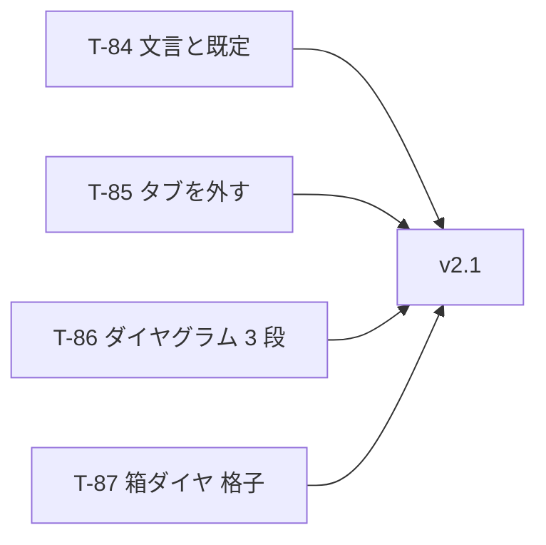

# UoDia 実装計画書 v2.1

| 項目 | 内容 |
| --- | --- |
| ドキュメント版数 | 1.0 |
| 作成日 | 2026-08-09 |
| 対象 | UoDia v2.1 |
| 前提仕様書 | [specification.md](specification.md)・[specification-v2.md](specification-v2.md) v3.3 |
| 前提 | [implementation-plan.md](implementation-plan.md)（T-01〜T-55）・[implementation-plan-v1.1.md](implementation-plan-v1.1.md)（T-56〜T-69）・[implementation-plan-v2.md](implementation-plan-v2.md)（T-70〜T-83） |

### 改訂履歴

| 版 | 日付 | 内容 |
| --- | --- | --- |
| 1.0 | 2026-08-09 | 初版。v2.0.0 を配ったあとに出た 4 件（#219〜#222）に対する **T-84〜T-87** を起こす。 |

---

## 1. 本書の位置づけ

**v2.0.0 を配ってから出た指摘に応える。** タスク番号は T-83 の続き（**T-84〜T-87**）とする。方針・技術的な設計判断・issue 化の方針は v1.0 の本書をそのまま引く。

### 1.1 v2 と違うところ

**動くものを見てから出た指摘である。**

| | v2 | v2.1 |
| --- | --- | --- |
| 起点 | issue → 仕様書 → タスク | **動くもの → 指摘 → 仕様書 → タスク** |
| 着手時の未確定 | 無し | **無し**（2026-08-09 にすべて決まった） |
| 仕様書 | 先に書いた | **書き換えることになる**（§1.3） |

### 1.2 対応する issue

| issue | タスク | 種別 |
| --- | --- | --- |
| #222 「路線図のまま（実線）」の書き方 | **T-84** | 不具合 |
| #221 GTFS の事業者・停留所タブを外す | **T-85** | 削る |
| #219 ダイヤグラムを 3 段に割る | **T-86** | 変える |
| #220 箱ダイヤを 3 行 2 列に | **T-87** | 変える |

### 1.3 仕様書を書き換えるところ

**4 件のうち 3 件が、既に書いてある決めを取り消す。** 取り消す決めと、取り消す理由を先に並べておく。

| 節 | 今の決め | 変える先 | なぜ |
| --- | --- | --- | --- |
| v2 §5.4.1 | 時間範囲は**全便が入る範囲**（1 段） | **固定の 3 段**（7-13 / 12-18 / 17-23） | 15 時間を 1754px に詰めると 1 分が約 1.9px。**5 分の折返しが紙で 0.5mm にしかならない** |
| v2 §5.5.6 | **全運用を 1 ページ**に収めた 1 枚。改ページしない | **1 マス 1 運用**の格子。**改ページしてよい** | 運用が増えるほど段が詰まり、**1 台ぶんの形が読めなくなる** |
| v2 §3.2 | GTFS 画面は **4 タブ** | **2 タブ**（カレンダー・書き出し） | 事業者と緯度経度は**変わらない値**であり、打てる場所に置くと打ち間違いの入口になる |

**§5.5.2（段の間隔は一定）は取り消さない。** 図の高さが便の数だけで決まるという性質は、**改ページを許しても失われない**——何ページになるかを描く前に計算できる。

---

## 2. マイルストーン

**4 つとも互いに独立である。** 束ねる必要が無い。



**小さいものから入れる。** T-84 と T-85 は S であり、先に片付けておけば、大きい 2 つを見るときに枝が 1 本で済む。

---

## 3. 技術的な設計判断

v2 の §3 に足すもの。**v2 の判断は 1 つも覆さない。**

### 3.1 既定の線種を 2 か所で決めない（T-84）

**これが #222 の原因である。**

```ts
画面（SettingsDialog）: serviceType === 'express' ? '破線' : '実線'
描画（tripStyle）:      isDeadhead ? DEADHEAD_DASH : dashForServiceType(serviceType ?? 'local')
```

**画面は回送を見ていない。** `route.json` の回送 6 パターンは `serviceType` を持たないため、**画面は「実線」と書き、絵は破線を引く。**

> **同じことを 2 か所に書けば、いつか片方だけが古くなる。** ここでは「片方だけ古い」ですらなく、**最初から食い違っていた**——回送の判定が描画側にしか無かった。

**画面が描画と同じ関数から引く形にする。** 既定を返す関数を 1 つ用意し、両方がそれを呼ぶ。

### 3.2 書き出しの視野は「1 枚に 1 つ」をやめる（T-86・T-87）

いまはどちらも**紙 1 枚に視野 1 つ**である。

```ts
drawDiagram(ctx, scene, exportViewport(scene, page));       // 1 枚 = 1 視野
drawBlockChart(ctx, scene, fitBlockChart(scene, page));     // 同上
```

**視野を複数返す形に変える。** 描画関数は 1 つも変えない——**`(ctx, scene, viewport)` の 3 引数はそのままで、呼ぶ回数が増えるだけ**である。

```ts
for (const band of exportBands(scene, page)) {
  drawDiagram(ctx, scene, band.viewport);
}
```

**切り取りは描画側が既に持っている。** `drawTrips` は `plotXRange` で描画領域の外を切り落としており、**段ごとに違う `startTime` を渡せば、その段の時間帯だけが出る。** 新しい切り取りを書かない。

### 3.3 マスの中に描くのは変換ではなく視野で行う（T-87）

格子の 1 マスに描く方法は 2 つある。

| | |
| --- | --- |
| `ctx` に平行移動を積む | `DrawContext` に `translate` が要る。**14 メソッドが 15 になる** |
| **視野の `originX` / `originY` をずらす** | **`DrawContext` は増えない** |

**後者を採る。** 実装計画書 v2 §3.3 の「`DrawContext` は増やさない」をそのまま守る。`BlockChartViewport` は既に `originX` / `originY` / `width` / `height` を持っており、**マスの矩形をそのまま入れれば済む。**

---

## 4. タスク一覧

| # | 名前 | issue | 規模 | 依存 |
| --- | --- | --- | --- | --- |
| T-84 | 既定の線種を 1 か所にし、文言を直す | #222 | S | — |
| T-85 | GTFS の事業者・停留所タブを外す | #221 | S | — |
| T-86 | ダイヤグラムを固定 3 段に割る | #219 | M | — |
| T-87 | 箱ダイヤを 3 行 2 列の格子にする | #220 | M | — |

**規模の目安は v1.0 と同じ**（S = 約 0.5 人日、M = 約 1.5 人日）。合計はおよそ **4 人日**。

---

## 5. タスク詳細

### T-84 既定の線種を 1 か所にし、文言を直す

**目的**: #222 を直す。

**背景**: 画面と描画が別々に既定を決めており、**回送で食い違っている**（[§3.1](#31-既定の線種を-2-か所で決めないt-84)）。

**作業内容**

- [ ] 既定の線種を返す関数を `features/diagram/tripStyle.ts` に置く（`assignPatternDashes` と同じ判定を使う）
- [ ] `SettingsDialog` がその関数から引く。**`serviceType` を読み直さない**
- [ ] 「路線図のまま」を**別の言い方に変える**。停留所の線種（`gridStyle`）側も揃える
- [ ] 「路線図のままに戻す」ボタンの文言（2 か所）も揃える

**受入条件**

- [ ] **回送パターンの選択肢に「破線」と出る**
- [ ] 既定を**描画と同じ出どころ**から取っている（画面に `serviceType` の判定が無い）
- [ ] 停留所側と言い方が揃っている
- [ ] 「路線図」という語が設定ダイアログから消えている

**規模**: S ／ **依存**: —

---

### T-85 GTFS の事業者・停留所タブを外す

**目的**: #221。**変わらない値を打てる場所に置かない。**

**背景**: T-70 で `route.json` 版数 3 に実例の値が入っている。**打つべきものは既に入っており、欄は「打ち直せる」ことだけを伝えている。**

**作業内容**

- [ ] `GtfsDialog` のタブを**カレンダーと書き出しの 2 つ**にする
- [ ] `agency.ts` / `coordinates.ts` / `gtfsService.ts` のうち、**画面のためだけにあるものを落とす**（`readiness.ts` が使っているものは残る）
- [ ] 書き出しタブの「足りないもの」で、事業者と緯度経度を**タブの無い項目**にする（直す先は `route.json`）
- [ ] R-14・R-15 はそのまま残す

**受入条件**

- [ ] GTFS 画面のタブが 2 つになっている
- [ ] `saveNetworkDef` が GTFS 画面から呼ばれない
- [ ] 事業者・緯度経度が欠けていれば、書き出しタブに**直す先が `route.json` だと分かる形**で出る
- [ ] R-14・R-15 が今までどおり出る

**規模**: S ／ **依存**: —

---

### T-86 ダイヤグラムを固定 3 段に割る

**目的**: #219。仕様書 v2 §5.4.1 を書き換える。

**決まっていること**（2026-08-09）

| | |
| --- | --- |
| 時間帯 | **固定**。7:00-13:00 / 12:00-18:00 / 17:00-23:00（**1 時間ずつ重なる**） |
| 便が無い段 | **出す**（固定であるため） |
| 22:00〜23:00 | **白紙**。描ける範囲（`plotXRange`）は広げない |
| 段の高さ | **均等**（3 等分） |
| 紙 | **A4 横 1 枚**のまま |

**作業内容**

- [ ] `exportBands(page)` を足す——3 つの `Viewport` を返す純関数（[§3.2](#32-書き出しの視野は1-枚に-1-つをやめるt-86t-87)）
- [ ] 段ごとに `originY` をずらし、高さを 3 等分する
- [ ] `drawDiagram` を段の数だけ呼ぶ。**PNG も PDF も同じ**
- [ ] `drawnTimeRange`（全便が入る範囲）を**使わなくなる**——落とすか、残すかを決める

**受入条件**

- [ ] PNG・PDF がどちらも 3 段になっている
- [ ] 段の時間帯が 7-13 / 12-18 / 17-23 である
- [ ] **重なりの時間帯にある便が、両方の段に出ている**
- [ ] **PNG と PDF で絵が食い違わない**（同じ場面・同じ視野の並びから出る）
- [ ] 22:00 以降が白紙である（線も字も出ない）
- [ ] A4 横 1 枚のままである

**規模**: M ／ **依存**: —

---

### T-87 箱ダイヤを 3 行 2 列の格子にする

**目的**: #220。仕様書 v2 §5.5.6 を書き換える。

**決まっていること**（2026-08-09）

| | |
| --- | --- |
| 紙 | **A4 縦** |
| 格子 | **3 行 2 列**。1 マスに **1 運用** |
| 空きマス | **空欄のまま**（詰めない） |
| 横軸の見出し | **マスごとに出す** |
| 段の高さ | **そのダイヤの最大運行本数に合わせ、全マスで同じ高さ**を使う |
| 改ページ | **してよい**（運用が 7 つ以上のとき） |

> **段の高さを全マスで揃えるのは、マスをまたいで段の位置が揃うためである。** 運用ごとに高さを変えると、隣のマスと見比べたときに**「便が多いのか、段が広いのか」が読めない。**

**作業内容**

- [ ] `blockChartCells(scene, page)` を足す——運用ごとにマスの矩形と `BlockChartViewport` を返す
- [ ] マスへの割り当ては**視野の `originX` / `originY` で行う**（[§3.3](#33-マスの中に描くのは変換ではなく視野で行うt-87)）
- [ ] 段の高さは**最も便の多い運用**から決め、全マスで共有する
- [ ] 7 つめ以降はページを足す
- [ ] `drawBlockChart` を**マスごとに 1 運用だけ渡して**呼ぶ

**受入条件**

- [ ] 箱ダイヤ PDF が **A4 縦**である
- [ ] 3 行 2 列の格子に分かれ、**1 マスに 1 運用**だけが描かれる
- [ ] 運用が 6 つ以下なら 1 ページ、7 つ以上なら 2 ページになる
- [ ] **何ページになるかを描く前に計算している**
- [ ] 空きマスに何も描かれない
- [ ] **全マスの段の高さが同じ**である
- [ ] 横軸の見出しがマスごとに出る

**規模**: M ／ **依存**: —

---

## 6. リスクと対策

| リスク | 対策 |
| --- | --- |
| **仕様書の決めを 3 つ取り消す。** 取り消した理由が残らないと、次に読む人が元へ戻す | 改訂履歴に**なぜ取り消したか**を書く（[§1.3](#13-仕様書を書き換えるところ)） |
| 段・マスに分けた結果、**字が読めない大きさになる** | どちらも**描く前に大きさが計算できる**。下限を決め、テストで固定する |
| PNG と PDF が別々の視野を組み立て、**絵が食い違う** | 視野を返す関数を 1 つにし、両方がそれを呼ぶ。**T-78 の受入条件をそのまま引く** |

---

## 7. 本書で扱わない事項

- **タブを外したあとの `route.json` の編集手段**（T-85）。手で直す。設定ダイアログに欄を作ることはしない
- **描ける範囲（7:00〜22:00）を広げること**（T-86）。22:00 以降は白紙とする
- **箱ダイヤの改ページの版面**（T-87）。2 ページ目以降も同じ 3 行 2 列とする
