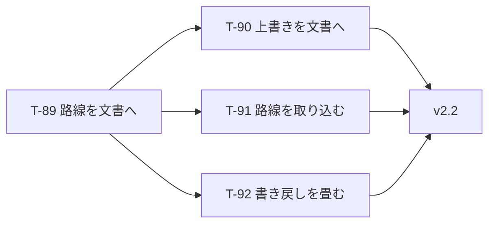

# UoDia 実装計画書 v2.2

| 項目 | 内容 |
| --- | --- |
| ドキュメント版数 | 1.0 |
| 作成日 | 2026-08-11 |
| 対象 | UoDia v2.2 |
| 前提仕様書 | [specification.md](specification.md)・[specification-v2.md](specification-v2.md) v3.5 |
| 前提 | [implementation-plan.md](implementation-plan.md)（T-01〜T-55）・[implementation-plan-v1.1.md](implementation-plan-v1.1.md)（T-56〜T-69）・[implementation-plan-v2.md](implementation-plan-v2.md)（T-70〜T-83）・[implementation-plan-v2.1.md](implementation-plan-v2.1.md)（T-84〜T-88） |
| 対応 issue | [#235](https://github.com/sairidoukoukai/UoDia/issues/235) |

### 改訂履歴

| 版 | 日付 | 内容 |
| --- | --- | --- |
| 1.0 | 2026-08-11 | 初版。**運行経路を `.uodia` に取り込む**（#235）ための **T-89〜T-92** を起こす。 |

---

## 1. 本書の位置づけ

**`.uodia` を自己完結させる。** 運行経路の定義（いまの `route.json`）を文書の中に持たせ、**文書だけで同じ絵が出る**ようにする。

### 1.1 なぜいま

**新しい運行経路が増えることを見込んでいる。** いまの作りでは、新経路を検討するために区間を触ると**現行ダイヤの時刻も一緒に動く**——便が保存しているのは基準時刻 1 点だけで、残りは `segments.runMinutes` から導出されるためである（`src/domain/network/networkIndex.ts:83`）。

**「現行」と「新経路案」を並べて見比べられない。** 窓を 2 つ開いても、どちらも同じ `route.json` を読む（`src-tauri/src/paths.rs:33`）。

**ダイヤグラム設計ソフトで経路を設計するときに、普通にやりたいことができない。**

### 1.2 仕様書を書き換えるところ

**2 つ取り消す。取り消す理由を先に並べておく。**

| 節 | 今の決め | 変える先 | なぜ |
| --- | --- | --- | --- |
| v2 §3.5 | **路線の事実は `route.json` へ。** 停留所がどこにあるかはどのプロジェクトを開いても同じ | **路線は文書のもの** | 新経路が増える。**同じであってほしいという前提が崩れた** |
| §6.5.3 | 色と線種の上書きは**設定**に置く（路線の事実とその人の目は別物） | **プロジェクト**に置く | 路線が文書ごとに枝分かれすると、**同じ `S4` が別の便を指す** |

**§5.8 の「運用の色はプロジェクトに置く」は取り消さない。** そちらの理由（渡した相手の画面でも同じ色で見えてほしい）は、むしろ強まる。

### 1.3 本書で扱わないこと

- **ポータブル版**（[specification-portable.md](specification-portable.md)）。T-93 以降とし、**本書の後**に置く。順序の理由は同書 §8 の P-2 にある
- **`backup.uodia` の取り合い。** 2 つ起動すると後から書いたほうで上書きされる。**本書では直さない**——ポータブル版で置き場所を触るため、そこで一緒に見る

---

## 2. マイルストーン



**T-89 が全部の前提である。** 残る 3 つは互いに独立で、順序は問わない。

---

## 3. 技術的な設計判断

### 3.1 `selectNetwork` の形を変えない

**これが本作業の要である。**

```ts
// いま
export function selectNetwork(state: AppState): NetworkIndex | null {
  return networkOf(state.networkDef);          // ストアの最上位
}

// あと
export function selectNetwork(state: AppState): NetworkIndex | null {
  return networkOf(state.project?.network ?? null);   // 文書の中
}
```

**戻り値の型も、呼び方も変わらない。** 路線を読む側（描画・時刻の導出・検証・GTFS）は**1 行も変わらない。** 変わるのは、この関数の中だけである。

> **置き場所を変える作業を、意味を変える作業にしない。** 同時に触ると、絵が変わったときに「引っ越しのせいか、直したせいか」が分からなくなる。

### 3.2 移行で埋めるのは「その環境の `route.json`」

**同梱のものではない。**

版数 4 のファイルには路線が入っていない。開くときに埋める必要があるが、**同梱の `route.json` で埋めると、作られた当時と違う路線が入り込む**——利用者が隠し設定で所要時間を直していれば、その文書はその値で描かれていた。

**その環境がいま読んでいる `route.json` を埋める。** それが、そのファイルが作られた路線である。

### 3.3 表示の上書きは移さない（2026-08-11 決定）

版数 4 のファイルを開いても、**いまの設定に入っている `patternStyles` / `stopGridStyles` は文書へ写さない。**

| | |
| --- | --- |
| 写す | 開いた瞬間の見た目が今までと同じ。**開いた全部の文書に自分の色が焼き付く** |
| **写さない**（採用） | 上書きが消える。**一度選び直すことになる** |

**上書きは「その人の目」のために選ばれたものである**（仕様書 §6.5.3 の元の理由）。文書に焼き付けると、**渡した相手にも付いて回る。** 選び直しは一度で済む。

**消えたことは伝える**（[§5.2](#t-90-表示の上書きをプロジェクトへ移す)）。黙って消すと「壊れた」と読まれる。

### 3.4 履歴と未保存の扱いが 1 つになる

いま `editNetwork` と `editProject` は**同じ履歴に積まれている**（`src/store/store.ts:364`）。にもかかわらず未保存の判定は `project` しか見ておらず（`src/store/selectors.ts:91`）、**区間を変えても「未保存」にならない。**

**保存先が 2 つに分かれていることの帰結であり、取り込めば消える。** これは T-89 の副産物であって、別に直すものではない。

### 3.5 検証がファイルごとになる

R-01〜R-15 はいま「共有された 1 つの路線」を見ている。取り込むと**ファイルごと**の検査になる。

**通らない路線を持つ `.uodia` が存在しうる。** 手で編集された文書、あるいは将来の版で作られた文書である。**開けなくしない**——読み込みの段階で弾くと、直す手立てごと失う。検証パネルに出す。

---

## 4. タスク一覧

| # | 名前 | 規模 | 依存 |
| --- | --- | --- | --- |
| T-89 | `.uodia` に路線を持たせる（版数 5） | **L** | — |
| T-90 | 表示の上書きをプロジェクトへ移す | M | T-89 |
| T-91 | 別の `.uodia` から路線を取り込む | M | T-89 |
| T-92 | `saveNetworkDef` と `networkDefWritable` を畳む | S | T-89 |

**規模の目安は v1.0 と同じ**（S = 約 0.5 人日、M = 約 1.5 人日、L = 約 3 人日）。合計はおよそ **6.5 人日**。

---

## 5. タスク詳細

### T-89 `.uodia` に路線を持たせる（版数 5）

**目的**: #235 の本体。文書を自己完結させる。

**作業内容**

- [ ] `projectSchema` に `network: networkDefSchema` を足す
- [ ] `CURRENT_FORMAT_VERSION` を 5 にし、**4 → 5 の変換**を書く（[§3.2](#32-移行で埋めるのはその環境の-routejson)）
- [ ] 変換は**その環境の `route.json` を要る**。`migrateProjectData` に渡せる形にする
- [ ] `selectNetwork` を `state.project?.network` から引く（[§3.1](#31-selectnetwork-の形を変えない)）
- [ ] ストア最上位の `networkDef` と `setNetworkDef` を落とす
- [ ] `editNetwork` を「プロジェクトの中の路線を編集する」形にする
- [ ] 起動時の読み込みは残す。**新規作成の種としてだけ**使う（`App.tsx:124`）
- [ ] `newProject` が**いま開いている文書の路線**を引き継ぐことを確かめる（`fileService.ts:156` は既にそうなっている）

**受入条件**

- [ ] 版数 4 のファイルが開ける。**開いた絵が今までと同じ**である
- [ ] 保存し直すと版数 5 になり、**路線が中に入っている**
- [ ] **路線の違う 2 つの `.uodia` を、2 つの窓で開いて見比べられる**
- [ ] 区間を変えると**未保存になる**（[§3.4](#34-履歴と未保存の扱いが-1-つになる)）
- [ ] `selectNetwork` を呼んでいる側が**1 行も変わっていない**
- [ ] 検証を通らない路線を持つ文書が**開ける**（検証パネルに出る。[§3.5](#35-検証がファイルごとになる)）

**規模**: L ／ **依存**: —

---

### T-90 表示の上書きをプロジェクトへ移す

**目的**: 路線が枝分かれしたときに、**同じ ID が別のものを指す**問題を断つ。

**背景**: `patternStyles` は `patternId`、`stopGridStyles` は `stopId` で引いている。どちらも**設定**（機械ごと）にある。

**作業内容**

- [ ] `viewSettingsSchema` に移す（`blockColors` の隣。仕様書 §5.8 と同じ形）
- [ ] `persistedSettingsSchema` から落とす
- [ ] **移行では写さない**（[§3.3](#33-表示の上書きは移さない2026-08-11-決定)）
- [ ] **一度だけ知らせる。** 版数 4 のファイルを開いたときに、上書きが引き継がれないことを伝える
- [ ] 設定ダイアログの表示タブを、**プロジェクトを編集する**形にする

**受入条件**

- [ ] 選んだ色と線種が `.uodia` に入る
- [ ] **渡した相手の画面で同じ色で見える**
- [ ] 別のファイルを開いても、**前のファイルの色が付いてこない**
- [ ] 版数 4 のファイルを開くと、**上書きが引き継がれないことが画面に出る**
- [ ] 設定ファイルから `patternStyles` / `stopGridStyles` が消える

**規模**: M ／ **依存**: T-89

---

### T-91 別の `.uodia` から路線を取り込む

**目的**: いまは `route.json` を直せば全ファイルに効いた。取り込んだあとは**ファイルごと**になる。

> **これが無いと、新経路を足すたびに全部の文書を手で直すことになる。** 取り込みは、失われた「1 か所直せば効く」の代わりである。

**作業内容**

- [ ] `ファイル > 路線を取り込む…` を足す
- [ ] 別の `.uodia`（または `route.json`）を選ばせ、**その路線だけ**を今の文書へ当てる
- [ ] 当てる前に**何が変わるかを見せる**（停留所・区間・パターンの増減）
- [ ] **便が参照しているパターンが消える場合は、消えることを先に言う**——当ててから「時刻が出ない便が 12 件」では遅い
- [ ] 履歴に積む（取り消せる）

**受入条件**

- [ ] 別の文書の路線を当てられる
- [ ] **当てる前に増減が見える**
- [ ] 参照が壊れる便があれば**先に分かる**
- [ ] <kbd>Ctrl</kbd>+<kbd>Z</kbd> で戻る

**規模**: M ／ **依存**: T-89

---

### T-92 `saveNetworkDef` と `networkDefWritable` を畳む

**目的**: 路線が文書に入れば、**`route.json` へ書き戻す道そのものが要らない。**

**作業内容**

- [ ] `PlatformAdapter.saveNetworkDef` を落とす
- [ ] `PlatformCapabilities.networkDefWritable` を落とす
- [ ] Web 版の「書き出して差し替えてください」の一連を落とす（仕様書 §6.5.5）
- [ ] Tauri の `write_route_def` コマンドを落とす
- [ ] `loadNetworkDef` は**残す**（新規作成の種）

**受入条件**

- [ ] **Web 版とデスクトップ版でできることが同じになる**（路線について）
- [ ] 設定ダイアログから「route.json に書き戻す」が消える
- [ ] 新規作成が今までどおり動く

**規模**: S ／ **依存**: T-89

---

## 6. リスクと対策

| リスク | 対策 |
| --- | --- |
| **版数 5 の移行を誤ると、既存の文書が開けなくなる。** 最も重い失敗である | 版数 1〜4 の実ファイルを**そのまま読むテスト**を置く。移行後の絵が移行前と同じであることを、時刻の値で突き合わせる |
| **上書きが消えたことに気づかれず「壊れた」と読まれる** | 一度だけ知らせる（T-90）。**黙って消さない** |
| 路線が文書ごとになり、**新経路を足すたびに全文書を直すことになる** | T-91。**取り込みが無いまま出さない** |
| 設定ダイアログの隠し設定（`patternsUnlocked`）が、**文書を壊す道になる** | 隠し設定の扱いは変えない（起動のたびに閉じる）。編集先がプロジェクトへ移るだけである |
| **同梱 `route.json` が古びる** | 古びても害が出ない置き方にする（[T-89](#t-89-uodia-に路線を持たせる版数-5)）。使われるのは**その環境で一番最初の 1 回だけ**である |

---

## 7. 本書で扱わない事項

- **ポータブル版**（[specification-portable.md](specification-portable.md)）。T-93 以降
- **`backup.uodia` の取り合い。** ポータブル版で置き場所を触るときに見る
- **路線の差分を絵で見せること**（T-91 は増減の数を出すところまで）
