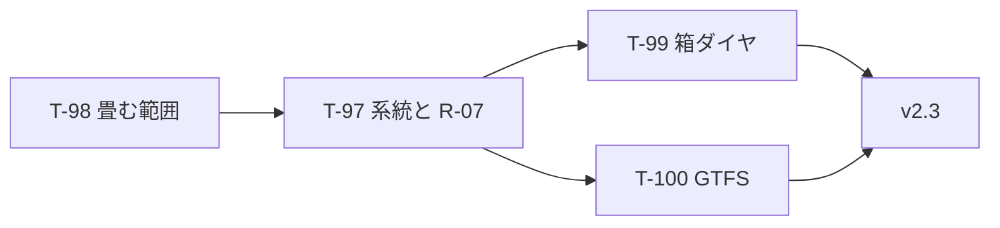

# UoDia 実装計画書 v2.3

| 項目 | 内容 |
| --- | --- |
| ドキュメント版数 | 1.0 |
| 作成日 | 2026-08-13 |
| 対象 | UoDia v2.3 |
| 前提仕様書 | [specification.md](specification.md)・[specification-v2.md](specification-v2.md) v3.6 |
| 前提 | [implementation-plan-v2.2.md](implementation-plan-v2.2.md)（T-89〜T-92）・T-93〜T-96（ポータブル版） |
| 対応 issue | [#247](https://github.com/sairidoukoukai/UoDia/issues/247) |

### 改訂履歴

| 版 | 日付 | 内容 |
| --- | --- | --- |
| 1.0 | 2026-08-13 | 初版。**停留所間の回送**（#247）のための **T-97〜T-100** を起こす。 |

---

## 1. 本書の位置づけ

**区間便どうしを繋ぐ回送を表せるようにする。**

箕面止まりの便のあと、同じ車で豊中発の便を出したい。車は空車で箕面→豊中を走る。**いまはこれを表せない。**

### 1.1 いま何が起きるか

同じ運用番号で並べると、エラーになる。

```
V-01: この便は 箕面 着ですが、次の便は 豊中 発です
```

営業所を経由すれば表せる（`DM-in` → `DT-out`）が、**車庫は箕面と豊中の間に無い。** 走らない経路を挟むことになり、出入庫の時刻も箱ダイヤも GTFS も事実と違う。**表せるだけで、正しくない。**

### 1.2 決まっていること（2026-08-13）

| | |
| --- | --- |
| 表し方 | **系統を新設する。** 既存の `回送`（車庫との出入り 6 パターン）とは分ける |
| 置き方 | **便として置く。** 利用者が普通の便として足し、同じ運用番号を付ける |
| 新しいデータ | **要らない。** `StopPattern.isDeadhead` は最初からある |
| 箱ダイヤ | **棒として描く。段を 1 つ使う**（[§3.3](#33-箱ダイヤの例外は理由ごと消えるt-99)） |

### 1.3 仕様書を書き換えるところ

**2 つ取り消す。**

| 節 | 今の決め | 変える先 | なぜ |
| --- | --- | --- | --- |
| §6.1.7 / `Service.trips` | 便に**回送は含まない**（導出値） | **停留所間の回送は含む** | **2 便の間にあり、どちらか一方からは決まらない**（[§3.1](#31-導出できないものが-1-つ増えたt-97)） |
| §5.5.3 | 回送は**マークで表す**（棒にしない） | **停留所間の回送は棒にする** | 棒にしなかった理由は「車庫が横軸に無い」こと。**箕面も豊中も横軸にある** |

**R-07 は取り消しではなく、軸を移す**（[§3.2](#32-r-07-の軸を営業所から系統へ移すt-97)）。

**§6.1.6（便番号は導出）と §6.1.7 の出入庫の扱いは変えない。** 出入庫は営業便から完全に決まるため、今までどおり `pullOut` / `pullIn` の真偽値で持つ。

---

## 2. マイルストーン



**T-98 を先に入れる。** 畳む範囲を狭めないまま回送を置けるようにすると、**置いた便が次に開いたときに消える。**

---

## 3. 技術的な設計判断

### 3.1 導出できないものが 1 つ増えた（T-97）

**「導出できるものは持たない」は変えていない。**

| | 決まり方 | 持ち方 |
| --- | --- | --- |
| 出入庫 | **営業便から完全に決まる**（0 分折返しの制約） | `pullOut` / `pullIn` の真偽値 |
| 停留所間の回送 | **2 便の間にある。** どちらか一方からは決まらない | **便として持つ** |

版数 3 は「回送便を独立した `Trip` として保存しない」と決めた。理由は**営業便を動かすと置いていかれる**ことだった。

> **その理由は出入庫にしか当たらない。** 出入庫は「勝手に生えたもの」であり、置いていかれても利用者は気づけない。**停留所間の回送は利用者が自分で置いたものであり、自分で直せる。**

### 3.2 R-07 の軸を営業所から系統へ移す（T-97）

R-07 はいま**営業所を軸**にしている。

```
含む営業所 ⟺ isDeadhead
```

**系統を軸にすれば、同じ形のまま書き直せる。**

```
回送の系統に属する ⟺ isDeadhead
```

**狙いは変わらない**——「回送かどうかを 2 か所に書かない」。照らす相手が変わるだけである。

**`derive.ts` は変えない。** 出入庫と待機の判定は `isDepot` で行っており、**それは正しいままである**——出庫は「営業所を出ること」であり、停留所間の回送が増えても意味は変わらない。**コメントだけ直す**（`回送 ⟺ 営業所` の同値が成り立たなくなるため）。

### 3.3 箱ダイヤの例外は、理由ごと消える（T-99）

§5.5.3 が回送を棒にしなかった理由は 1 つだった。

> 回送も棒で描くと、車庫（横軸のどこにも無い）まで棒を伸ばすことになり、**横軸が停留所であるという決めが崩れる。**

**停留所間の回送には当てはまらない。** 両端とも横軸にある。**例外の理由が消えたのだから、例外も消す。**

| | 描き方 |
| --- | --- |
| 出入庫 | **マーク**（今までどおり）。段を使わない |
| 停留所間の回送 | **棒**。段を 1 つ使う。線種は破線 |

**§5.5.2 の「図の高さは便の数だけで決まる」は保たれる。** 数える「便」に停留所間の回送が入るだけであり、**描く前に計算できる**という性質は変わらない。

### 3.4 畳む範囲は「営業所に接する回送」（T-98）

`foldDeadheads` は**開くたびに走り**、`isDeadhead` の便をすべて畳む。版数 2 → 3 の移行のために書いたもので、**当時は回送＝出入庫しか無かった。**

**営業所に接するものだけを畳む。** 接しないものは便として残す。

> **移行の手順が、移行と関係ない便を消していた。** 気づけたのは、回送の種類が増えたからである。

---

## 4. タスク一覧

| # | 名前 | 規模 | 依存 |
| --- | --- | --- | --- |
| T-98 | 畳む回送を営業所に接するものに狭める | S | — |
| T-97 | 回送の系統を増やし、R-07 の軸を移す | M | T-98 |
| T-99 | 箱ダイヤで停留所間の回送を棒にする | M | T-97 |
| T-100 | GTFS の回送系統の決め打ちを直す | S | T-97 |

**規模の目安は v1.0 と同じ**（S = 約 0.5 人日、M = 約 1.5 人日）。合計はおよそ **4 人日**。

---

## 5. タスク詳細

### T-98 畳む回送を営業所に接するものに狭める

**目的**: 置いた回送が**次に開いたときに消える**のを防ぐ。

**作業内容**

- [ ] `foldServiceDeadheads`（`domain/io/load.ts`）で、**営業所に接する回送だけ**を畳む
- [ ] 接しない回送は便として残す。**W-06 を出さない**
- [ ] 版数 2 のファイルが今までどおり畳まれることを確かめる

**受入条件**

- [ ] 営業所に接しない回送便が、**開き直しても残る**
- [ ] 出入庫は今までどおり `pullOut` / `pullIn` へ畳まれる
- [ ] **畳めない出入庫は今までどおり W-06 で捨てる**（運用番号が違うなど）

**規模**: S ／ **依存**: —

---

### T-97 回送の系統を増やし、R-07 の軸を移す

**目的**: #247 の本体。

**作業内容**

- [ ] R-07 を**系統を軸にした形**へ書き換える（[§3.2](#32-r-07-の軸を営業所から系統へ移すt-97)）
- [ ] `route.json` に**停留所間の回送の系統**と、そのパターンを足す
- [ ] `Service.trips` の定義を直す（`domain/model/project.ts`）
- [ ] `derive.ts` のコメントを直す。**判定は変えない**
- [ ] V-01 が鳴らないことを確かめる（**鎖が繋がるため、変更は要らないはず**）

**受入条件**

- [ ] 箕面止まりの便のあとに、**同じ運用で豊中発の便を置ける**
- [ ] 間の回送を便として置くと、**V-01 が鳴らない**
- [ ] 回送に**便番号が振られない**（営業便の番号が動かない）
- [ ] 「回送便」のチェックを外すと**ダイヤグラムから消える**
- [ ] 出入庫は今までどおり真偽値で持つ（**ファイルに回送便として現れない**）

**規模**: M ／ **依存**: T-98

---

### T-99 箱ダイヤで停留所間の回送を棒にする

**目的**: §5.5.3 の例外を、理由ごと外す。

**作業内容**

- [ ] `barsOf`（`features/blockchart/scene.ts`）が**停留所間の回送を段にする**
- [ ] 線種を破線にする（営業便と見分ける）
- [ ] **出入庫は今までどおりマーク**。段を使わない
- [ ] 途中入庫（T-88）と混ざらないことを確かめる

**受入条件**

- [ ] 停留所間の回送が**棒として描かれる**
- [ ] 営業便と**線種で見分けられる**
- [ ] 出入庫は今までどおりマークで、**段を使わない**
- [ ] 図の高さが**描く前に計算できる**（§5.5.2）

**規模**: M ／ **依存**: T-97

---

### T-100 GTFS の回送系統の決め打ちを直す

**目的**: 系統が 2 つになる。

**作業内容**

- [ ] `DEADHEAD_ROUTE_NAME = '回送'`（`domain/export/gtfs/build.ts:77`）をやめる
- [ ] `routes.txt` に新系統が出ることを確かめる
- [ ] `translations.txt` の除外（`build.ts:473`）も系統名の決め打ちをやめる

**受入条件**

- [ ] `routes.txt` に**回送の系統が 2 つ**出る
- [ ] `trips.txt` の回送便が**正しい系統を指す**
- [ ] 公式の検証器（`gtfs-validator`）が**エラー 0 のまま**

**規模**: S ／ **依存**: T-97

---

## 6. リスクと対策

| リスク | 対策 |
| --- | --- |
| **置いた回送が消える。** 最も重い失敗である | T-98 を先に入れる。**開き直しても残ること**をテストで固定する |
| **停留所対の組み合わせが増える。** 3 拠点なら 6 通り、停留所が増えるとさらに | 新系統に入れたものだけが**繋いでよい組み合わせ**になる。全部を先回りして作らない |
| 置いた回送が、前の便を動かしたときに**置いていかれる** | **利用者が自分で置いたものであり、自分で直せる**（[§3.1](#31-導出できないものが-1-つ増えたt-97)）。V-01 が繋がらなくなったことを知らせる |
| 出入庫と停留所間の回送が**画面で見分けられない** | 箱ダイヤでは段の有無で分かれる（T-99）。ダイヤグラムでは**どちらも破線**であり、見分けは系統名による |

---

## 7. 本書で扱わない事項

- **停留所間の回送を導出すること**。便として置くと決めた（[§1.2](#12-決まっていること2026-08-13)）
- **回送どうしを繋ぐこと**（回送 → 回送）。要るという話が出ていない
- **`route.json` にどの停留所対を入れるか**。データの判断であり、実装の判断ではない
