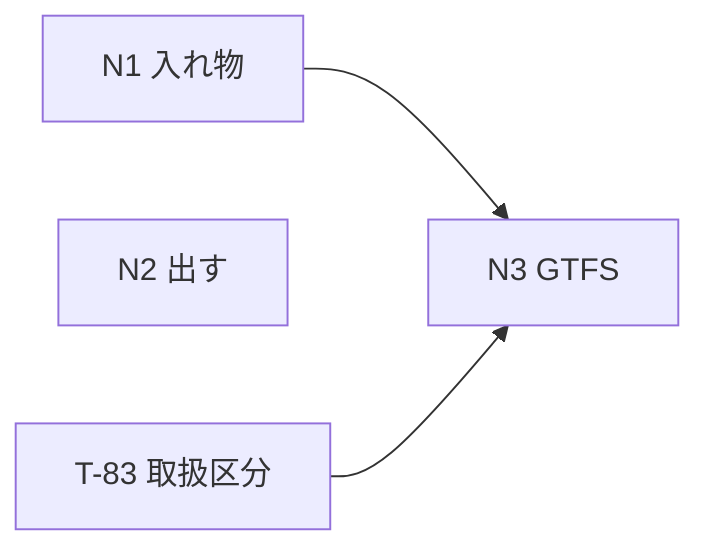

# UoDia 実装計画書 v2

| 項目 | 内容 |
| --- | --- |
| ドキュメント版数 | 1.0 |
| 作成日 | 2026-08-07 |
| 対象 | UoDia v2 |
| 前提仕様書 | [specification-v2.md](specification-v2.md) v3.2 |
| 前提 | [implementation-plan.md](implementation-plan.md)（v1.0、T-01〜T-55）・[implementation-plan-v1.1.md](implementation-plan-v1.1.md)（v1.1、T-56〜T-69） |

### 改訂履歴

| 版 | 日付 | 内容 |
| --- | --- | --- |
| 1.0 | 2026-08-07 | 初版。仕様書 v2（v3.2、**未確定事項ゼロ**）に対する T-70〜T-83 を起こす。 |

---

## 1. 本書の位置づけ

**v1.0 と v1.1 の実装計画書を置き換えない。** タスク番号は T-69 の続き（**T-70〜T-83**）とする。方針（[§2 開発方針](implementation-plan.md)）・技術的な設計判断（§3）・issue 化の方針（§7）は v1.0 の本書をそのまま引く。

### 1.1 v1.1 と違うところ

**仕様が先に固まっている。** v1.1 は issue が先にあり、実装しながら仕様を決めた。v2 は**仕様書 v3.2 の時点で未確定事項がゼロ**であり、**書き始める前に決まっていないことが無い。**

| | v1.0 | v1.1 | v2 |
| --- | --- | --- | --- |
| 起点 | 仕様書 → タスク → issue | issue → 仕様書 → タスク | **issue → 仕様書 → タスク** |
| 着手時の未確定 | Q-4 のみ | Q-12・Q-16 | **無し** |
| issue タイトル | `[T-xx]` | 元のまま | **元のまま**（#163・#192〜#198・#202） |

**新しく issue を起こす必要は無い。** 既にある issue にタスク番号を対応させる。

### 1.2 対応する issue

| issue | タスク |
| --- | --- |
| #198 GTFS に要る静的データ | T-70 |
| #197 運行日カレンダー | T-71・T-73 |
| #192 ダイヤグラムの書き出し | T-75・T-78 |
| #196 UoDia2csv | T-76 |
| #194 箱ダイヤ（全体） | T-79・T-80 |
| #163 GTFS 書き出し | T-72・T-81・T-82 |
| #202 取扱区分の訂正 | T-83 |
| ~~#193 箱ダイヤ（運用系統別）~~ | **廃止**（仕様書 v2 §5.5.6） |
| ~~#195 停留所時刻表データ~~ | **対象外**（同 Q-23） |

---

## 2. マイルストーン

仕様書 v2 §11 の 3 つの束をそのまま引く。

| # | 束 | 内容 | 特徴 |
| --- | --- | --- | --- |
| **N1** | 入れ物 | T-70〜T-73 | **データモデルと画面。** 何も出力しない |
| **N2** | 出す | T-74〜T-80 | **N1 と独立**。書き出しの器と 5 つの成果物 |
| **N3** | GTFS | T-81・T-82 | N1 の上に載る |
| — | 訂正 | T-83 | **独立。T-82 より前に入れる** |

**N1 と N2 は互いに独立であり、どちらからでも始められる。** N2 のほうが早く目に見えるものが出る（T-75 の PNG は器さえあれば出る）。

---

## 3. 技術的な設計判断

v1.0 の §3 に足すもの。**v1.0 の判断は 1 つも覆さない。**

### 3.1 zip を自前で書く

**圧縮しないと決めた**（仕様書 v2 §5.3）。中身の大半は PNG と PDF であり、どちらも既に圧縮されている。

**圧縮しないなら、zip は自前で書ける。** 無圧縮（store）の zip に要るのは、ローカルファイルヘッダ・中央ディレクトリ・終端レコードと **CRC32** だけである。圧縮アルゴリズムを持ち込む必要が無い。

| | |
| --- | --- |
| 依存を足す場合 | `fflate` などが要る。**使うのは無圧縮の道だけ**であり、圧縮の実装は丸ごと余る |
| 自前で書く場合 | 200 行ほど。**書いたものはテストできる**（既存の zip 展開ツールで開けることを確かめる） |

**依存は PDF で 2 つ増える**（[§3.2](#32-pdf-は-pdf-lib--fontkit-に頼る)）。**増やす先を選ぶのであって、増やさないことを目的にしない**——PDF は自前で書けないが、zip は書ける。

### 3.2 PDF は pdf-lib + fontkit に頼る

**日本語をベクタで出すには、フォントをサブセット化して CID キーの形で埋める必要がある**（仕様書 v2 §5.4.2）。これは自前で書く範囲を超える。

| パッケージ | 用途 | 大きさ（gzip 後・実測） | ライセンス |
| --- | --- | --- | --- |
| `pdf-lib` | PDF の組み立て | **206KB** | MIT |
| `@pdf-lib/fontkit` | フォントのサブセット化 | **329KB** | MIT |
| Noto Sans JP Regular | 埋める書体 | **約 3.9MB** | OFL-1.1 |

**3 つとも遅延して読む。** 書き出しが押されるまで読まない（仕様書 v2 §5.4.2）。**初回ロードは 45KB のまま**であることを T-77 の受入条件で機械が見る。

### 3.3 `DrawContext` は増やさない

**PDF 用の実装（`PdfDrawContext`）は、いまある 14 メソッドだけを満たす。**

`DrawContext` は「使う機能をここに列挙しておく。増やすときは『本当に要るか』を一度考えることになる」という意図で作られている（`src/features/diagram/drawContext.ts`）。**PDF のために 1 つでも足したら、その意図が壊れる**——足した瞬間、画面用・記録用・PDF 用のすべてがそれを実装する義務を負う。

**足したくなったら、描画側を直す。** 器に合わせるのは描くほうである。

### 3.4 箱ダイヤは `domain` に計算を置かない

**`deriveBlocks` が既に全部出している**（仕様書 v2 §5.5.4）。箱ダイヤに要るのは**座標を決めること**だけであり、それは描画の仕事である。

**`src/domain/blockchart/` を作らない。** 作ると「段の高さ」「棒の左右」のような**画面の都合が `domain` に入る。** v1.0 の制約（`domain` は純粋なドメインロジック）を守る。

### 3.5 CSV の組み立ては `domain` に置く

**こちらは逆である。** 時刻表の CSV は「行と列に何を並べるか」であり、**px も canvas も出てこない。**

`src/domain/export/` に純関数として置く（仕様書 v2 付録 A）。**時刻表の画面（`features/timetable/model.ts`）とは別に書く**——写す先が表であることは同じでも、**画面は React の要素を、CSV は文字列を組む。**

---

## 4. タスク一覧

| # | タスク | issue | 束 | 規模 | 依存 |
| --- | --- | --- | --- | --- | --- |
| T-70 | `route.json` 版数 3（事業者・緯度経度・訳語・系統の色） | #198 | N1 | M | — |
| T-71 | `.uodia` 版数 4（運行日カレンダー）と暦の計算 | #197 | N1 | M | — |
| T-72 | GTFS 画面の枠と、事業者・停留所タブ | #163 | N1 | M | T-70 |
| T-73 | カレンダータブ | #197 | N1 | **L** | T-71・T-72 |
| T-74 | 書き出しの器（`saveExport`・zip・メニュー） | #192 | N2 | M | — |
| T-75 | ダイヤグラム PNG | #192 | N2 | S | T-74 |
| T-76 | 時刻表 CSV（方向別 2 つ） | #196 | N2 | M | T-74 |
| T-77 | `PdfDrawContext` とフォントの遅延読込 | #192 | N2 | **L** | T-74 |
| T-78 | ダイヤグラム PDF | #192 | N2 | S | T-75・T-77 |
| T-79 | 箱ダイヤの描画（`drawBlockChart`） | #194 | N2 | **L** | — |
| T-80 | 箱ダイヤ PDF（1 枚） | #194 | N2 | S | T-77・T-79 |
| T-81 | GTFS 書き出しタブ（足りないものの表示まで） | #163 | N3 | S | T-72・T-73 |
| T-82 | GTFS の生成（10 ファイル）と zip | #163 | N3 | **L** | T-74・T-81・T-83 |
| T-83 | 取扱区分の訂正（コンベ前・人科前） | #202 | — | S | — |

**規模の目安は v1.0 と同じ**（S = 約 0.5 人日、M = 約 1.5 人日、L = 約 4 人日）。合計はおよそ **28 人日**。

---

## 5. タスク詳細

### N1: 入れ物

#### T-70 `route.json` 版数 3

**目的**: 仕様書 v2 §7.1 を実装する（#198）。

**背景**: GTFS に出すのに要る静的データが `route.json` に無い。**すべて実例（`docs/gtfs_example/`）の中にあり、写すだけで揃う。**

**作業内容**

- [ ] `NetworkDef` に `agency` を足す（`src/domain/model/network.ts`）
- [ ] `Stop` に `lat` / `lon` / `nameKana` / `nameEn` を足す。**すべて任意**
- [ ] 系統ごとの表（`routeName` をキー）に `color` / `textColor` / `kana` / `en` を足す
- [ ] R-14（`agency` の必須項目）・R-15（緯度経度）を足す（`src/domain/network/validate.ts`）。**版数 3 以上にのみ適用**——R-13 と同じ作りにする
- [ ] `data/route.json` を版数 3 に上げ、**実例の値を入れる**（7 停留所の緯度経度、26 行の訳語、5 系統の色）

**受入条件**

- [ ] 版数 2 の `route.json` がそのまま読める。R-14・R-15 は適用されない
- [ ] 版数 3 で `agency` や緯度経度が欠けていれば R-14・R-15 が出る
- [ ] **車庫（`isDepot: true`）は R-15 の対象外**（`stops.txt` には出すが、`stop_lat` は要る——**実例が持っているため入れる**）
- [ ] 画面の見た目が 1 つも変わっていない

**規模**: M ／ **依存**: —

> **`pattern.color` は触らない。** 系統の色（`bdd7ee`）と別に持つ（仕様書 v2 §6.8）。**用途が違うものを 1 つにまとめない**——画面のスジは濃い色、GTFS の地色は淡い色である。

---

#### T-71 `.uodia` 版数 4（運行日カレンダー）と暦の計算

**目的**: 仕様書 v2 §4.4・§7.2 を実装する（#197）。**画面はまだ作らない。**

**背景**: `Service` は名前しか持たず、どの日に走るのかがデータに無い。

**作業内容**

- [ ] `ServiceCalendar` / `ClosedRange` / `Weekday` を足す（`src/domain/model/project.ts`）。**`Service.calendar` は任意**
- [ ] `formatVersion` を 4 に上げ、移行を足す（`src/domain/io/migrate.ts`）。**版数 3 以前はカレンダーを持たないダイヤとして開き、警告も出さない**
- [ ] `src/domain/calendar/` を新設し、**純関数だけ**を置く
  - [ ] 範囲を日ごとに展開する
  - [ ] 走る日を数える（曜日 − 運行なしの範囲）
  - [ ] **曜日で既に外れている日を、運行なしの展開から落とす**（仕様書 v2 §4.6）
- [ ] V-10（範囲が有効期間の外）・V-11（走る日が 0）を足す。**どちらも警告**
- [ ] スキーマ段で弾くもの: `weekdays` が空 / `from` > `to` / `startDate` > `endDate` / 日付の形

**受入条件**

- [ ] 版数 3 の `.uodia` がそのまま開き、**警告が出ない**
- [ ] 保存し直すと版数 4 になる
- [ ] 範囲が重なっていても、走る日の数が二重に減らない
- [ ] 年をまたぐ有効期間（`2026-04-01`〜`2027-03-31`）で正しく数える
- [ ] `src/domain/calendar/` が React も Tauri も import していない

**規模**: M ／ **依存**: —

---

#### T-72 GTFS 画面の枠と、事業者・停留所タブ

**目的**: 仕様書 v2 §3 を実装する（#163・#198）。

**背景**: 設定ダイアログには入れない（§3.1）。**画面が何も変わらない値を、画面を変える場所に置かない。**

**作業内容**

- [ ] `src/features/gtfs/` を新設する
- [ ] `commands.ts` に `file.gtfs`（`GTFS…`）を足す。**ショートカットは割り当てない**
- [ ] タブの枠を作る（事業者 / 停留所 / カレンダー / 書き出し）。**カレンダーと書き出しは空のまま**
- [ ] 事業者タブ: 5 項目。タイムゾーンと言語は既定値を入れておく
- [ ] 停留所タブ: 緯度・経度の欄。**停留所そのものは編集できない**
- [ ] 書き戻しは設定ダイアログと同じ作法（仕様書 §6.5.1）。**検証を通ったときだけ書く**

**受入条件**

- [ ] `ファイル > GTFS…` で開く
- [ ] 微生物研究所前に欄が出る（`hiddenInEditor` だが `stops.txt` には出す）
- [ ] **車庫にも欄が出る**（仕様書 v2 §3.4。版数 3.0 で改めた）
- [ ] 検証を通らない値を入れて閉じても、`route.json` が書き換わっていない
- [ ] Web 版では「書き戻せません」と出て、書き出しになる

**規模**: M ／ **依存**: T-70

---

#### T-73 カレンダータブ

**目的**: 仕様書 v2 §4.5 を実装する（#197）。

**背景**: **v2 で唯一の、新しい入力の形である。** 月のカレンダーを描き、ドラッグで範囲を選ぶ。

**作業内容**

- [ ] ダイヤを選ぶ欄、有効期間、走る曜日のチェック
- [ ] 月のカレンダー。**曜日で外れる日と、範囲で外れる日を描き分ける**——直し方が違う
- [ ] ドラッグで範囲を選ぶ。**指を離したときに履歴へ 1 段積む**（§4.5.1）
- [ ] 運行なしの期間の一覧（直接打てる・削除できる・`note` を書ける）
- [ ] 月送りは**有効期間の外へ出ない**（§4.5.2）

**受入条件**

- [ ] 範囲を 1 つ引くのに、取り消しが 1 回で済む
- [ ] 1 日だけの運行なしが作れる（`from` と `to` が同じ日）
- [ ] 曜日のチェックを外した日をクリックしても、範囲が増えない
- [ ] カレンダーを持たないダイヤを開いても落ちない
- [ ] キーボードだけで範囲を足せる（§9.4）

**規模**: **L** ／ **依存**: T-71・T-72

---

### N2: 出す

#### T-74 書き出しの器（`saveExport`・zip・メニュー）

**目的**: 仕様書 v2 §5.1〜§5.3・§5.8 を実装する（#192）。**まだ何も中身を作らない。**

**作業内容**

- [ ] `PlatformAdapter` に `saveExport(content: Uint8Array, suggestedName: string)` を足す（`src/platform/types.ts`）。**バイト列で受け取る**
- [ ] Tauri 側: 保存先を尋ねて書く。**アトミック書き込み**
- [ ] ブラウザ側: ダウンロードする
- [ ] **無圧縮 zip を自前で書く**（[§3.1](#31-zip-を自前で書く)）。CRC32 と 3 つのレコード
- [ ] `commands.ts` に `file.export`（`書き出し…`）を足す
- [ ] 進み具合を出す。**画面を止めない**
- [ ] 失敗の扱い（§5.8）。**全部を作り終えてから書く**

**受入条件**

- [ ] 出来た zip が既存の展開ツールで開ける（Windows のエクスプローラ・`unzip`・macOS の Finder）
- [ ] 日本語のファイル名が化けない
- [ ] 便が 1 つも無いときは「便がありません」と出て、**ファイルを作らない**
- [ ] 途中で失敗したとき、**半分だけ入った zip が残らない**
- [ ] 保存先を選ばずに閉じたら何も起きない

**規模**: M ／ **依存**: —

---

#### T-75 ダイヤグラム PNG

**目的**: 仕様書 v2 §5.4.1 を実装する（#192）。

**背景**: **描画関数は既に引数化されている**（実装計画書 §3.5）。書くのは器だけである。

**作業内容**

- [ ] オフスクリーン canvas を作り、`drawDiagram` をそのまま呼ぶ
- [ ] 時間範囲は**全便が入る範囲**。画面の視野ではない
- [ ] 解像度は **A4 横 300dpi 相当**（3508 × 2480px）
- [ ] 配色は**明るいほうで固定**する。紙に黒地は刷らない
- [ ] 表示設定（色・線種・フィルタ）は画面のものを使う

**受入条件**

- [ ] 一番早い便と一番遅い便が両方入っている
- [ ] 画面を暗い配色にしていても、出る絵は明るい
- [ ] **画面をスクロールした位置に結果が左右されない**
- [ ] フィルタで隠した便は出ない

**規模**: S ／ **依存**: T-74

---

#### T-76 時刻表 CSV（方向別 2 つ）

**目的**: 仕様書 v2 §5.6 を実装する（#196）。

**背景**: **画面の写しである。** 別の並びを発明しない。

**作業内容**

- [ ] `src/domain/export/` に純関数で組み立てを置く（[§3.5](#35-csv-の組み立ては-domain-に置く)）
- [ ] 行の並びは時刻表タブと同じ（便番号・パターン・運用・前運用・停留所・次運用）
- [ ] 升目: 経由しない停留所も未入力も**空欄。区別しない**
- [ ] 時刻は `7:40` のまま。**24 時を超える表記もそのまま**
- [ ] **UTF-8（BOM 付き）・CRLF**。RFC 4180 の引用符
- [ ] 方向ごとに 2 ファイル

**受入条件**

- [ ] Excel で開いて停留所名が化けない（**BOM が付いている**）
- [ ] 画面の時刻表と行・列が 1 対 1 で対応している
- [ ] 回送便が列になっていない（前運用・次運用の行に畳まれている）
- [ ] 値に `,` を含む文字列（運用番号など）が壊れない
- [ ] `src/domain/export/` が React を import していない

**規模**: M ／ **依存**: T-74

---

#### T-77 `PdfDrawContext` とフォントの遅延読込

**目的**: 仕様書 v2 §5.4.2・§5.4.3 を実装する（#192）。**v2 で最も重いタスクである。**

**背景**: **日本語をベクタで出すにはフォントの同梱が要る。** 受け取った人が停留所名を検索できることに意味がある。

**作業内容**

- [ ] `pdf-lib` と `@pdf-lib/fontkit` を依存に足す
- [ ] Noto Sans JP Regular（OFL-1.1）をリポジトリ直下に置き、`bundle.resources` に足す
- [ ] **OFL の本文を配布物に同梱する**
- [ ] `src/features/export/pdf/` に `PdfDrawContext` を書く。**`DrawContext` の 14 メソッドだけを満たす**（[§3.3](#33-drawcontext-は増やさない)）
- [ ] `embedFont(bytes, { subset: true })` で埋める
- [ ] **すべて動的 import にする。** 書き出しが押されるまで読まない

**受入条件**

- [ ] **Web 版の初回ロードが 45KB のまま**である（`dist/assets` を数えて確かめる。**フォントもライブラリも別チャンクに出ている**）
- [ ] **デスクトップ版のバイナリが 30MB 以内**（`scripts/check-bundle-size.mjs`）
- [ ] 出来た PDF で停留所名を検索できる
- [ ] 拡大しても線と字が滲まない
- [ ] `DrawContext` にメソッドが 1 つも増えていない
- [ ] ヘルプに依存パッケージとフォントの表示が出る

**規模**: **L** ／ **依存**: T-74

> **画面には使わない。** 同梱したフォントを画面にも使うと、初回ロードに 3.9MB が乗る（仕様書 v2 §5.4.3）。

---

#### T-78 ダイヤグラム PDF

**目的**: 同じ `drawDiagram` を `PdfDrawContext` に流す（#192）。

**作業内容**

- [ ] T-75 が決めた viewport をそのまま使う
- [ ] A4 横 1 ページ

**受入条件**

- [ ] **PNG と PDF で絵が食い違わない**（同じ場面・同じ viewport から出ることをテストで固定する）
- [ ] 字が字として入っている（画像になっていない）

**規模**: S ／ **依存**: T-75・T-77

---

#### T-79 箱ダイヤの描画（`drawBlockChart`）

**目的**: 仕様書 v2 §5.5 を実装する（#194）。**v2 で唯一の新しい絵である。**

**背景**: **横軸が停留所、便は水平の棒、便が 1 本進むごとに段が 1 つ下りる。** 往復すれば四角形、途中で折り返せば「コ」の字になる。

**作業内容**

- [ ] `src/features/blockchart/` を新設する。**`domain` には置かない**（[§3.4](#34-箱ダイヤは-domain-に計算を置かない)）
- [ ] `drawBlockChart(ctx, blocks, viewport)`。**ダイヤグラムと同じ 3 引数**
- [ ] 横位置は `Stop.axisPosition` から取る（**ダイヤグラムの縦軸と同じ値**）
- [ ] **段の間隔は一定**（§5.5.2）。図の高さは便の数だけで決まる
- [ ] 出庫は始発停留所の**上**、入庫は終着停留所の**下**にマーク（§5.5.3）。**棒にしない**
- [ ] 折返し時分と時刻を字で添える（形に出ないため）
- [ ] 運用の色は `src/domain/block/colors.ts` から取る。**画面と同じ色**

**受入条件**

- [ ] `deriveBlocks` の結果だけを読み、**新しい導出を書いていない**
- [ ] 1 往復が四角形として閉じる
- [ ] 区間便の棒が、端から端までの便より短い
- [ ] 車庫が横軸に現れない（マークだけ）
- [ ] 便の数が同じ 2 つの運用が、同じ高さで描かれる
- [ ] 便が 1 本もない運用があっても落ちない

**規模**: **L** ／ **依存**: —

---

#### T-80 箱ダイヤ PDF（1 枚）

**目的**: 仕様書 v2 §5.5.6 を実装する（#194）。

**背景**: **運用ごとの出力（#193）は廃止した。全運用を 1 ページに収める。**

**作業内容**

- [ ] 全運用の段を積み、**1 ページに収まるよう縮める**
- [ ] 改ページを持たない

**受入条件**

- [ ] 運用が 5 つでも 10 つでも 1 ページに収まる
- [ ] **収まるかどうかを描く前に計算している**（段の間隔が一定であるため。§5.5.2）
- [ ] 字が読める大きさで残っている（縮めすぎない下限を決める）

**規模**: S ／ **依存**: T-77・T-79

---

### N3: GTFS

#### T-81 GTFS 書き出しタブ

**目的**: 仕様書 v2 §3.2 の 4 つめのタブを作る（#163）。

**作業内容**

- [ ] 足りないものの一覧を出す（緯度経度が空・カレンダーが無い・`agency` が空）
- [ ] 出せる状態なら書き出しボタンを押せるようにする
- [ ] **実例と違える 4 点を書いておく**（仕様書 v2 §6.7）

**受入条件**

- [ ] カレンダーを持たないダイヤでは「運行日がありません」と出て、押せない
- [ ] 何が足りないかが、直せる場所（どのタブか）とあわせて分かる

**規模**: S ／ **依存**: T-72・T-73

---

#### T-82 GTFS の生成（10 ファイル）と zip

**目的**: 仕様書 v2 §6.4〜§6.6 を実装する（#163）。

**背景**: **突き合わせ先が `docs/gtfs_example/` にある。** 出したものが実例と一致することを機械が見られる。

**作業内容**

- [ ] `src/domain/export/gtfs/` に**純関数**で 10 ファイルを組み立てる
- [ ] 共通仕様: **UTF-8（BOM 付き）・LF・末尾改行・`7:15:00` 形式・`YYYYMMDD`**
- [ ] `agency.txt` / `feed_info.txt`: 固定値
- [ ] `stops.txt`: **車庫は `location_type: 1`**
- [ ] `routes.txt`: `route_id` = `patternId`。**`route_long_name` は方向でひっくり返さない**
- [ ] `trips.txt`: `trip_id` = 便番号（回送は `D1` `D2` …）。`service_id` = **`daily` 固定**。`trip_headsign` = **終着停留所名**。`shape_id` は**空**
- [ ] `stop_times.txt`: **`stop_sequence` を 1 から順に振る**。`pickup_type` / `drop_off_type` を `Handling` から出す
- [ ] `calendar.txt` / `calendar_dates.txt`: T-71 の計算を使う。**`exception_type: 1` は出さない**
- [ ] `translations.txt`: `route.json` の訳語から
- [ ] `office_jp.txt` / `transfers.txt`: **見出しだけ**
- [ ] `shapes.txt`: **固定のファイルを素通しする**（§6.5.7）。何にも依存させない
- [ ] **回送便を出す**（`deriveBlocks` が展開したものを使う）

**受入条件**

- [ ] **実例と突き合わせるテストが通る**（§6.7 の 4 点と、簡潔にした `route_id` / `trip_id` を除く）
- [ ] `stop_sequence` が便ごとに 1 から増えている
- [ ] コンベンションセンター前と微生物研究所前に `pickup_type: 1`、人間科学部前に `drop_off_type: 1` が出る（**T-83 が入っていること**）
- [ ] `calendar_dates.txt` に、**曜日で既に外れている日が出ていない**
- [ ] `shapes.txt` が実例と 1 バイト違わない
- [ ] GTFS の検証器にかけて、致命的な指摘が出ない

**規模**: **L** ／ **依存**: T-74・T-81・**T-83**

---

### 独立

#### T-83 取扱区分の訂正

**目的**: `data/route.json` の誤りを直す（#202）。

**背景**: コンベンションセンター前と人間科学部前が `stop`（乗降とも）になっているが、**前者は降車専用、後者は乗車専用**である。**片方向のパターンにしか現れない停留所は、乗降のどちらかしか起きない。**

**作業内容**

- [ ] S1・S2・S3 のコンベンションセンター前を `alightOnly` に
- [ ] T1・T3・M4 の人間科学部前を `boardOnly` に
- [ ] **版数は上げない**（形は変わらず、値の訂正である）

**受入条件**

- [ ] 6 か所が直っている
- [ ] **時刻表の見た目が変わっていない**（記号は升目から外してある。T-54）
- [ ] 既存の `.uodia` がそのまま開ける
- [ ] R-01〜R-13 が通る

**規模**: S ／ **依存**: — ／ **T-82 より前に入れること**

---

## 6. リスクと対策

| # | リスク | 影響 | 対策 |
| --- | --- | --- | --- |
| **P1** | **フォントとライブラリが初回ロードに漏れる** | Web 版が 4MB 落ちる | **T-77 の受入条件で `dist/assets` を数える。** 動的 import が切れているかは実測でしか分からない |
| **P2** | デスクトップ版のバイナリが 30MB を超える | 仕様書 §9.1 未達 | フォント約 5.7MB を足したうえで `check-bundle-size.mjs` を回す。超えたら**サブセット化を前倒しする**（常用漢字 + かな） |
| **P3** | 一斉出力が 10 秒を超える | 使われなくなる | **300dpi の画像を 2 枚作るのが重い。** T-75 の時点で測り、必要なら解像度を落とす（**PDF はベクタであり、解像度に影響されない**） |
| **P4** | 自前の zip が特定の環境で開けない | 成果物が届かない | **T-74 の受入条件を 3 OS の標準ツールで確かめる。** 日本語ファイル名の扱い（UTF-8 フラグ）が最も危うい |
| **P5** | 箱ダイヤが 1 ページに収まらない | 読めない図が出る | **段の間隔が一定であるため、収まるかどうかは描く前に計算できる**（§5.5.2）。字の下限を決め、下回るときは知らせる |
| **P6** | 実例との突き合わせが**意味の無い差分**で落ち続ける | テストが信用されなくなる | **違える 4 点と簡潔にした 2 つの ID を、テスト側に明示的な除外として書く**（仕様書 v2 §6.7 と 1 対 1 に対応させる） |

---

## 7. 本書で扱わない事項

| 事項 | 扱い |
| --- | --- |
| #193 箱ダイヤ（運用系統別） | **廃止**（仕様書 v2 §5.5.6）。issue を閉じる |
| #195 停留所時刻表データの生成 | **対象外**（同 Q-23） |
| T-66 LICENSE の追加 | v1.1 の積み残し。Q-16（本文の起草）が解けていない |
| `shapes.txt` を便に繋ぐこと | **繋がない**（§6.5.7）。対応表は仕様書に残してある |
| 複数のダイヤを一度に書き出すこと | **1 つだけ出す**（§5.2）。`service_id` を `daily` に固定した決めがこれに依存している |
| 経路の形（道筋）を作ること | **作らない**。点を直線で結んだものはバスが通る道ではない |
